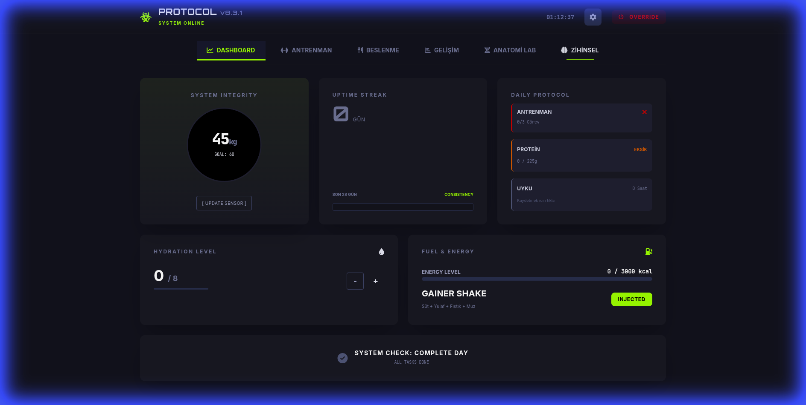
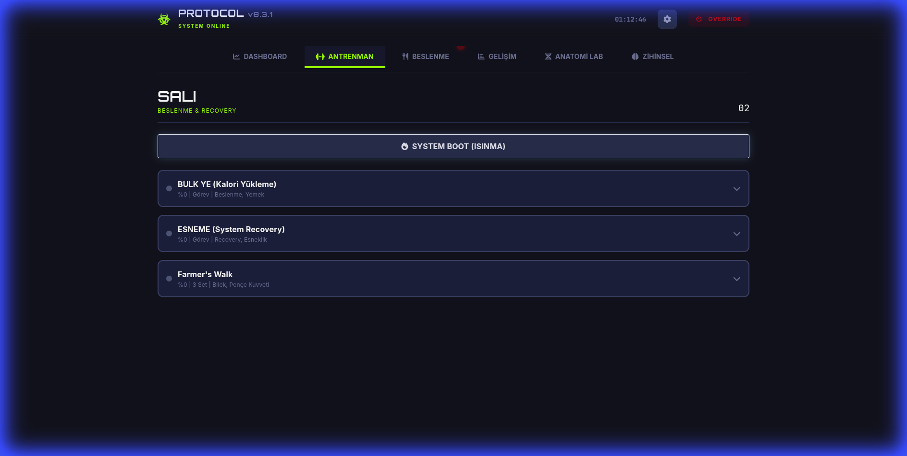
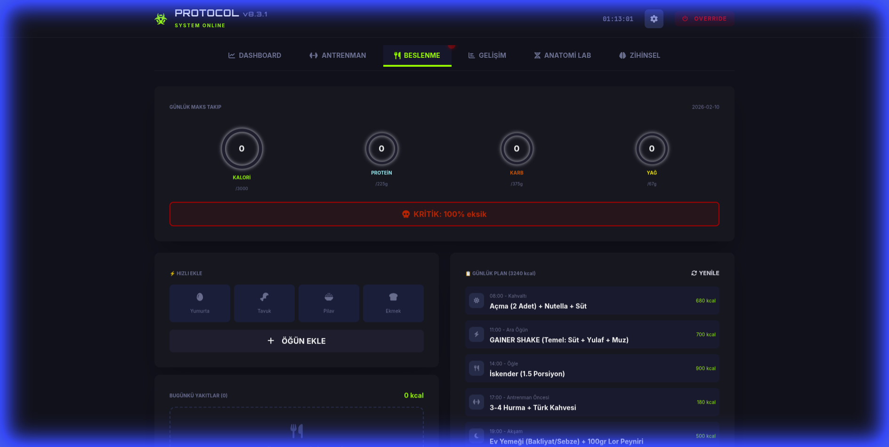
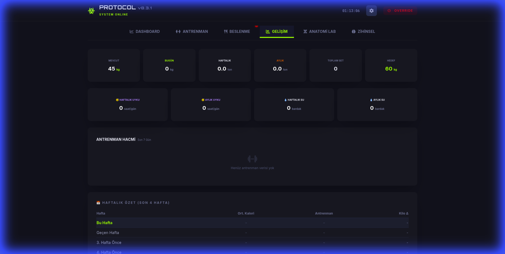
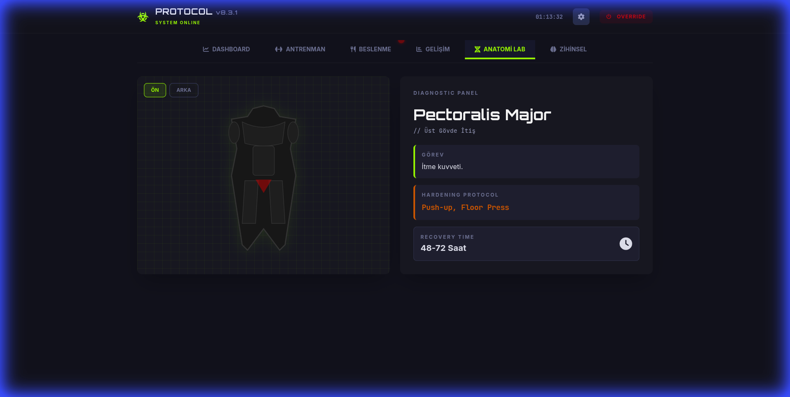
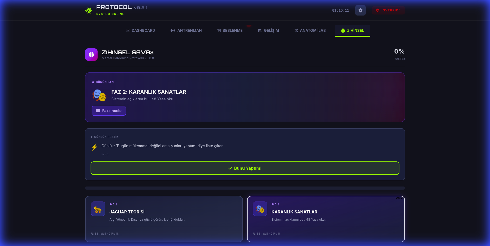

<p align="center">
  
</p>

<h1 align="center">🛡️ System Hardening Protocol</h1>

<p align="center">
  <strong>Military-grade personal tracking system for human performance optimization.</strong>
</p>

<p align="center">
  
  
  
  
  
</p>

<p align="center">
  <em>"Discipline equals Freedom."</em><br>
  Operational Security (OPSEC) for your biological and mental capabilities.
</p>

---

## ⚡ What Is This?

**System Hardening Protocol** is a zero-dependency, offline-first personal command center that treats your body and mind as a high-value asset. It compiles into a **single HTML file** — no servers, no cloud, no data leaks. Everything runs locally in your browser.

This is **not** a fitness tracker. This is **not** a diet app. This is a **command center** for your biological existence.

### Why Use It?

- 🔒 **100% Private** — All data stays in your browser's localStorage. No accounts, no tracking, no telemetry.
- ⚡ **Instant** — Single HTML file, zero load time. Works offline.
- 🎯 **All-in-One** — Training, nutrition, progress analytics, anatomy visualization, and mental conditioning in one place.
- 🖥️ **Cyberpunk UI** — Military-grade dark interface with neon accents. Not your average wellness app.
- 🕵️ **Stealth Mode** — Press `Ctrl+Shift+H` to instantly disguise the app in public.

---

## 🖥️ Command Center

### 📊 Dashboard (Situation Room)
Real-time diagnostics of your current status — weight tracking, uptime streaks, daily caloric breakdown, and mission completion status.

<p align="center">
  
</p>

### 🏋️ Training (Operations)
Full workout protocols with exercise databases, dynamic set management, volume tracking, and embedded video demonstrations.

<p align="center">
  
</p>

### 🍽️ Nutrition (Logistics)
Advanced macro tracking with protein/carb/fat/water monitoring, meal logging, custom food creation, and smart daily fuel calculations.

<p align="center">
  
</p>

### 📈 Progress (Intelligence)
Data analysis engine — weekly calorie summaries, workout volume trends, weight history graphs, and body measurement tracking.

<p align="center">
  
</p>

### 🧬 Anatomy Lab (Diagnostics)
Interactive visual body map for targeting specific muscle groups. Click on any muscle to view exercises, status, and diagnostic data.

<p align="center">
  
</p>

### 🧠 Mental Warfare (Psyops)
Psychological conditioning through 8 progressive phases, daily micro-actions, and perception management protocols.

<p align="center">
  
</p>

---

## 🛠️ Tech Stack

| Technology | Purpose |
|-----------|---------|
| **HTML5** | Single-file application structure |
| **Vanilla JavaScript** | Zero-framework, pure ES6+ logic |
| **Tailwind CSS** | Utility-first styling via CDN |
| **localStorage** | Client-side data persistence |
| **Node.js** | Build-time bundling only |
| **pnpm** | Package manager for build scripts |

### Architecture

```
State-Renderer-Actions Pattern

┌─────────┐     ┌───────────┐     ┌──────────┐
│  Store   │────▶│ Renderers │────▶│ Actions  │
│ (State)  │◀────│   (View)  │◀────│ (Logic)  │
└─────────┘     └───────────┘     └──────────┘
      │                                  │
      └──── localStorage ◀──────────────┘
```

**15 modular JS files** are concatenated in dependency order and injected into a single HTML template at build time. No bundler overhead. No virtual DOM. Pure performance.

---

## 🚀 Quick Start

### Prerequisites
- [Node.js](https://nodejs.org/) 18+
- [pnpm](https://pnpm.io/) (recommended) or npm

### Installation

```bash
# Clone the repository
git clone git@github.com:void0x14/System-Hardening-Protocol.git
cd System-Hardening-Protocol

# Build the application
pnpm run build

# Open the app
open dist/index.html   # macOS
xdg-open dist/index.html  # Linux
start dist/index.html  # Windows
```

### Or Simply

Download `dist/index.html` and open it in any modern browser. That's it. No install needed.

---

## 🕵️ Stealth Mode (OPSEC)

Press **`Ctrl + Shift + H`** to activate **Sanitize Mode**:
- Hides all sensitive metrics and personal data
- Changes branding to generic "Personal Tracker"
- Safe for use in public environments (office, library, etc.)

---

## 📁 Project Structure

```
System-Hardening-Protocol/
├── dist/
│   └── index.html          # ← Production build (single file)
├── src/
│   ├── template.html       # Base HTML template
│   ├── build.js            # Build script
│   ├── js/                 # 15 modular JavaScript files
│   │   ├── config.js       # Global configuration
│   │   ├── db/             # Exercise, food & plan databases
│   │   ├── store.js        # State management (localStorage)
│   │   ├── ui.js           # UI rendering engine
│   │   ├── actions.js      # User interaction handlers
│   │   └── app.js          # Entry point
│   └── styles/             # 4 CSS modules
├── docs/screenshots/       # Application screenshots
├── package.json            # Build scripts (pnpm)
├── LICENSE                 # MIT License
└── CONTRIBUTING.md         # Contribution guidelines
```

---

## 🗺️ Roadmap

- [ ] Test coverage with Playwright
- [ ] Accessibility (A11Y) improvements
- [ ] Data export/import (JSON backup)
- [ ] PWA support for mobile installation
- [ ] i18n — Multi-language support
- [ ] Performance profiling & optimization

See [CONTRIBUTING.md](CONTRIBUTING.md) for how to get involved.

---

## 📄 License

This project is licensed under the [MIT License](LICENSE).

---

## ⭐ Support

If this project helps you on your journey, consider giving it a **star** ⭐ — it helps others discover it.

---

<p align="center">
  <em>This is not a game. This is not a simulation. This is your life. Harden or perish.</em>
</p>
