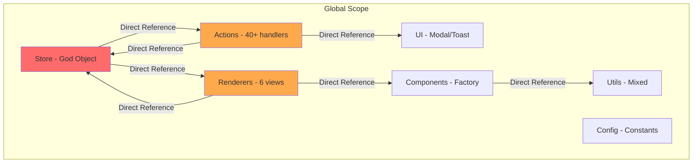
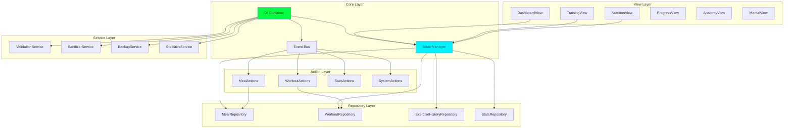

# System Hardening Protocol - Implementation Plan

**Document Version:** 2.0  
**Created:** 2026-02-14  
**Status:** Draft for Review  
**Target Codebase Version:** 8.3.1 → 9.0.0

---

## Executive Summary

This document provides a highly granular, phased implementation plan for refactoring the System Hardening Protocol codebase. The plan addresses critical architectural issues identified across 5 refactoring strategy documents:

| Issue | Severity | Current State |
|-------|----------|---------------|
| Global Scope Pollution | Critical | All modules in global namespace |
| God Object: Store.js | Critical | 35KB, 80+ methods, 8+ responsibilities |
| Monolithic Files | High | actions.js (47KB), dashboard.js (53KB) |
| Tight Coupling | High | No dependency injection |
| Hardcoded Configuration | Medium | Magic strings/numbers throughout |
| No Testing | Critical | 0% test coverage |

**IMPORTANT: Zero Dependencies Requirement**
This project maintains a strict zero-dependency policy. All solutions must be pure vanilla JavaScript with no external npm packages. Testing will use a custom-built test framework.

---

## Architecture Overview

### Current Architecture (Problematic)



### Target Architecture (After Refactoring)



---

## Phase 0: Preparation

**Objective:** Establish documentation and analysis infrastructure before any code changes.

### 0.1 Development Environment Setup

| Task | Description | Files Affected |
|------|-------------|----------------|
| 0.1.1 | Verify Node.js version compatibility | `package.json` |
| 0.1.2 | Create custom test runner framework | `tests/runner.js` (new) |
| 0.1.3 | Create assertion library | `tests/assert.js` (new) |
| 0.1.4 | Create test reporter | `tests/reporter.js` (new) |

**Custom Test Framework (Zero Dependencies):**
```javascript
// tests/assert.js - Simple assertion library
export function assertEqual(actual, expected, message = '') {
    if (actual !== expected) {
        throw new Error(`Assertion failed: ${message}\n  Expected: ${expected}\n  Actual: ${actual}`);
    }
}

export function assertTrue(value, message = '') {
    if (!value) {
        throw new Error(`Assertion failed: ${message}\n  Expected truthy value`);
    }
}

export function assertDeepEqual(actual, expected, message = '') {
    if (JSON.stringify(actual) !== JSON.stringify(expected)) {
        throw new Error(`Assertion failed: ${message}\n  Expected: ${JSON.stringify(expected)}\n  Actual: ${JSON.stringify(actual)}`);
    }
}

export function assertThrows(fn, message = '') {
    let threw = false;
    try {
        fn();
    } catch (e) {
        threw = true;
    }
    if (!threw) {
        throw new Error(`Assertion failed: ${message}\n  Expected function to throw`);
    }
}
```

```javascript
// tests/runner.js - Custom test runner
import { readFileSync, readdirSync } from 'fs';
import { join } from 'path';

class TestRunner {
    constructor() {
        this.tests = [];
        this.results = { passed: 0, failed: 0, errors: [] };
    }
    
    describe(name, fn) {
        console.log(`\n=== ${name} ===`);
        try {
            fn();
        } catch (e) {
            console.error(`Suite error: ${e.message}`);
        }
    }
    
    it(name, fn) {
        this.tests.push({ name, fn });
    }
    
    async run() {
        for (const test of this.tests) {
            try {
                await test.fn();
                this.results.passed++;
                console.log(`  ✓ ${test.name}`);
            } catch (e) {
                this.results.failed++;
                this.results.errors.push({ name: test.name, error: e.message });
                console.log(`  ✗ ${test.name}\n    ${e.message}`);
            }
        }
        
        console.log(`\nResults: ${this.results.passed} passed, ${this.results.failed} failed`);
        return this.results.failed === 0;
    }
}

export const runner = new TestRunner();
export const describe = runner.describe.bind(runner);
export const it = runner.it.bind(runner);
```

**Validation Criteria:**
- [ ] Custom test runner executes successfully
- [ ] Assertion library provides core assertions
- [ ] `npm test` runs custom test framework

### 0.2 Documentation Infrastructure

| Task | Description | Files Affected |
|------|-------------|----------------|
| 0.2.1 | Create `memory-bank/` directory structure | `memory-bank/` |
| 0.2.2 | Document current module dependency graph | `memory-bank/DEPENDENCIES.md` |
| 0.2.3 | Create API documentation template | `memory-bank/API_TEMPLATE.md` |
| 0.2.4 | Document current build process | `memory-bank/BUILD_PROCESS.md` |
| 0.2.5 | Create migration tracking spreadsheet | `memory-bank/MIGRATION_TRACKER.md` |

**Validation Criteria:**
- [ ] All memory-bank documents created
- [ ] Dependency graph accurately reflects current state

### 0.3 Code Analysis

| Task | Description | Files Affected |
|------|-------------|----------------|
| 0.3.1 | Generate cyclomatic complexity report (manual) | All `.js` files |
| 0.3.2 | Identify all global scope declarations | All `.js` files |
| 0.3.3 | Map all cross-file dependencies | All `.js` files |
| 0.3.4 | Document all magic numbers/strings | `store.js`, `actions.js` |
| 0.3.5 | Create baseline performance metrics | N/A |

**Validation Criteria:**
- [ ] Complexity report generated for all files
- [ ] All global declarations catalogued
- [ ] Baseline metrics documented

### 0.4 Test Infrastructure Setup

| Task | Description | Files Affected |
|------|-------------|----------------|
| 0.4.1 | Create test directory structure | `tests/` (new) |
| 0.4.2 | Create mock storage adapter | `tests/mocks/storage.js` (new) |
| 0.4.3 | Create mock DOM utilities | `tests/mocks/dom.js` (new) |
| 0.4.4 | Create test fixtures for sample data | `tests/fixtures/` (new) |
| 0.4.5 | Write smoke tests for current functionality | `tests/smoke/` (new) |

**Mock Storage Adapter (Zero Dependencies):**
```javascript
// tests/mocks/storage.js
export class MockStorage {
    constructor() {
        this.data = new Map();
    }
    
    getItem(key) {
        return this.data.has(key) ? this.data.get(key) : null;
    }
    
    setItem(key, value) {
        this.data.set(key, value);
    }
    
    removeItem(key) {
        this.data.delete(key);
    }
    
    clear() {
        this.data.clear();
    }
    
    get length() {
        return this.data.size;
    }
    
    key(index) {
        const keys = Array.from(this.data.keys());
        return keys[index] || null;
    }
}
```

**Validation Criteria:**
- [ ] Test infrastructure operational
- [ ] At least 5 smoke tests passing

---

## Phase 1: Foundation

**Objective:** Establish ES module system and dependency injection container.

### 1.1 ES Module Migration

| Task | Description | Files Affected |
|------|-------------|----------------|
| 1.1.1 | Add `type: module` to package.json | `package.json` |
| 1.1.2 | Create `src/js/index.js` as module entry point | `src/js/index.js` (new) |
| 1.1.3 | Convert `config.js` to ES module exports | `src/js/config.js` |
| 1.1.4 | Convert `utils.js` to ES module exports | `src/js/utils.js` |
| 1.1.5 | Convert `components.js` to ES module exports | `src/js/components.js` |
| 1.1.6 | Convert `ui.js` to ES module exports | `src/js/ui.js` |
| 1.1.7 | Convert `store.js` to ES module exports | `src/js/store.js` |
| 1.1.8 | Convert `actions.js` to ES module exports | `src/js/actions.js` |
| 1.1.9 | Convert `renderers/dashboard.js` to ES module | `src/js/renderers/dashboard.js` |
| 1.1.10 | Convert `app.js` to ES module imports | `src/js/app.js` |
| 1.1.11 | Update build.js for ES module output | `src/build.js` |
| 1.1.12 | Update template.html for module script | `src/template.html` |

**Validation Criteria:**
- [ ] No global scope pollution (verify with `Object.keys(window)`)
- [ ] All imports/exports working correctly
- [ ] Build output unchanged (functional parity)
- [ ] Application boots correctly

### 1.2 Dependency Injection Container

| Task | Description | Files Affected |
|------|-------------|----------------|
| 1.2.1 | Create `src/js/core/` directory | `src/js/core/` (new) |
| 1.2.2 | Implement `Container.js` - DI container | `src/js/core/Container.js` (new) |
| 1.2.3 | Add service registration methods | `src/js/core/Container.js` |
| 1.2.4 | Add service resolution methods | `src/js/core/Container.js` |
| 1.2.5 | Add singleton lifecycle management | `src/js/core/Container.js` |
| 1.2.6 | Write unit tests for Container | `tests/core/Container.test.js` (new) |

**Container Implementation (Pure Vanilla JS):**
```javascript
// src/js/core/Container.js
/**
 * Simple Dependency Injection Container
 * Zero external dependencies
 */
export class Container {
    constructor() {
        this.services = new Map();
        this.factories = new Map();
    }
    
    /**
     * Register a service factory
     * @param {string} name - Service name
     * @param {Function} factory - Factory function that receives container
     */
    register(name, factory) {
        this.factories.set(name, factory);
    }
    
    /**
     * Get a service instance (singleton)
     * @param {string} name - Service name
     * @returns {*} Service instance
     */
    get(name) {
        if (!this.services.has(name)) {
            const factory = this.factories.get(name);
            if (!factory) {
                throw new Error(`Service not found: ${name}`);
            }
            this.services.set(name, factory(this));
        }
        return this.services.get(name);
    }
    
    /**
     * Check if service is registered
     * @param {string} name - Service name
     * @returns {boolean}
     */
    has(name) {
        return this.factories.has(name);
    }
    
    /**
     * Clear all registered services (for testing)
     */
    clear() {
        this.services.clear();
        this.factories.clear();
    }
}
```

**Validation Criteria:**
- [ ] Container class implemented
- [ ] Unit tests passing (100% coverage of Container)
- [ ] Container integrated into app.js

### 1.3 Event Bus Implementation

| Task | Description | Files Affected |
|------|-------------|----------------|
| 1.3.1 | Create `EventBus.js` for decoupled communication | `src/js/core/EventBus.js` (new) |
| 1.3.2 | Implement event registration | `src/js/core/EventBus.js` |
| 1.3.3 | Implement event dispatch | `src/js/core/EventBus.js` |
| 1.3.4 | Implement event subscription/unsubscription | `src/js/core/EventBus.js` |
| 1.3.5 | Write unit tests for EventBus | `tests/core/EventBus.test.js` (new) |

**EventBus Implementation (Pure Vanilla JS):**
```javascript
// src/js/core/EventBus.js
/**
 * Simple Event Bus for decoupled communication
 * Zero external dependencies
 */
export class EventBus {
    constructor() {
        this.listeners = new Map();
    }
    
    /**
     * Subscribe to an event
     * @param {string} event - Event name
     * @param {Function} callback - Event handler
     * @returns {Function} Unsubscribe function
     */
    on(event, callback) {
        if (!this.listeners.has(event)) {
            this.listeners.set(event, new Set());
        }
        this.listeners.get(event).add(callback);
        return () => this.off(event, callback);
    }
    
    /**
     * Unsubscribe from an event
     * @param {string} event - Event name
     * @param {Function} callback - Event handler
     */
    off(event, callback) {
        if (this.listeners.has(event)) {
            this.listeners.get(event).delete(callback);
        }
    }
    
    /**
     * Emit an event
     * @param {string} event - Event name
     * @param {*} data - Event data
     */
    emit(event, data) {
        if (this.listeners.has(event)) {
            this.listeners.get(event).forEach(callback => {
                try {
                    callback(data);
                } catch (e) {
                    console.error(`Event handler error for ${event}:`, e);
                }
            });
        }
    }
    
    /**
     * Clear all listeners (for testing)
     */
    clear() {
        this.listeners.clear();
    }
}
```

**Validation Criteria:**
- [ ] EventBus class implemented
- [ ] Unit tests passing
- [ ] EventBus registered in Container

---

## Phase 2: Configuration Extraction

**Objective:** Extract all hardcoded values into a structured configuration layer.

### 2.1 Configuration Directory Structure

| Task | Description | Files Affected |
|------|-------------|----------------|
| 2.1.1 | Create `src/js/config/` directory | `src/js/config/` (new) |
| 2.1.2 | Create `keys.js` for storage key constants | `src/js/config/keys.js` (new) |
| 2.1.3 | Create `targets.js` for nutrition/fitness targets | `src/js/config/targets.js` (new) |
| 2.1.4 | Create `validation.js` for input validation limits | `src/js/config/validation.js` (new) |
| 2.1.5 | Create `theme.js` for UI theme constants | `src/js/config/theme.js` (new) |
| 2.1.6 | Create `index.js` for aggregated exports | `src/js/config/index.js` (new) |
| 2.1.7 | Update imports in all files | All `.js` files |

**Target Structure:**
```
src/js/config/
├── index.js          # Aggregated exports
├── keys.js           # Storage key constants
├── targets.js        # Nutrition/fitness targets
├── validation.js     # Input validation limits
└── theme.js          # UI theme constants
```

**Validation Criteria:**
- [ ] All config files created
- [ ] No magic numbers in store.js
- [ ] All imports updated

### 2.2 Extract Storage Keys

| Task | Description | Files Affected |
|------|-------------|----------------|
| 2.2.1 | Move `CONFIG.KEYS` to `keys.js` | `src/js/config/keys.js` |
| 2.2.2 | Add JSDoc documentation | `src/js/config/keys.js` |
| 2.2.3 | Add key validation function | `src/js/config/keys.js` |
| 2.2.4 | Update all references | All `.js` files |

**Example:**
```javascript
// src/js/config/keys.js
/**
 * Storage key constants for localStorage
 * @readonly
 */
export const STORAGE_KEYS = {
    /** Current weight in kg */
    WEIGHT: 'monk_weight',
    /** Last fuel/shake date */
    FUEL: 'monk_fuel_date',
    /** Workout log prefix - append date */
    WORKOUT: 'monk_workout_log_',
    // ... etc
};

/**
 * Validates if a key is a known storage key
 * @param {string} key - Key to validate
 * @returns {boolean}
 */
export function isValidStorageKey(key) {
    return Object.values(STORAGE_KEYS).some(k => 
        k.endsWith('_') ? key.startsWith(k) : key === k
    );
}
```

**Validation Criteria:**
- [ ] All storage keys extracted
- [ ] JSDoc documentation complete
- [ ] Validation function tested

### 2.3 Extract Validation Limits

| Task | Description | Files Affected |
|------|-------------|----------------|
| 2.3.1 | Identify all magic numbers in store.js | `src/js/store.js` |
| 2.3.2 | Create `VALIDATION_LIMITS` constant | `src/js/config/validation.js` |
| 2.3.3 | Document each limit with JSDoc | `src/js/config/validation.js` |
| 2.3.4 | Replace magic numbers with constants | `src/js/store.js` |

**Example:**
```javascript
// src/js/config/validation.js
/**
 * Input validation limits and constraints
 * @readonly
 */
export const VALIDATION_LIMITS = {
    /** Weight constraints in kg */
    WEIGHT: { MIN: 20, MAX: 500, UNIT: 'kg' },
    /** Maximum custom foods allowed */
    CUSTOM_FOODS_MAX: 300,
    /** Maximum exercise history entries per exercise */
    EXERCISE_HISTORY_MAX: 100,
    /** Maximum meal name length */
    MEAL_NAME_MAX_LENGTH: 120,
    /** Maximum sets per exercise */
    SETS_MAX: 64,
    /** Maximum daily workout tasks */
    WORKOUT_TASKS_MAX: 128
};
```

**Validation Criteria:**
- [ ] All magic numbers replaced
- [ ] Each limit documented
- [ ] No regression in functionality

### 2.4 Extract Theme Constants

| Task | Description | Files Affected |
|------|-------------|----------------|
| 2.4.1 | Move `THEME` object to `theme.js` | `src/js/config/theme.js` |
| 2.4.2 | Add color palette constants | `src/js/config/theme.js` |
| 2.4.3 | Add animation duration constants | `src/js/config/theme.js` |
| 2.4.4 | Update all references | All `.js` files |

**Validation Criteria:**
- [ ] Theme constants extracted
- [ ] No hardcoded CSS classes in logic

---

## Phase 3: Storage Abstraction

**Objective:** Create a storage adapter layer to decouple from localStorage.

### 3.1 Storage Adapter Interface

| Task | Description | Files Affected |
|------|-------------|----------------|
| 3.1.1 | Create `src/js/services/` directory | `src/js/services/` (new) |
| 3.1.2 | Create `StorageAdapter.js` interface | `src/js/services/StorageAdapter.js` (new) |
| 3.1.3 | Implement `LocalStorageAdapter` | `src/js/services/StorageAdapter.js` |
| 3.1.4 | Implement `WindowStorageAdapter` | `src/js/services/StorageAdapter.js` |
| 3.1.5 | Write unit tests for adapters | `tests/services/StorageAdapter.test.js` (new) |

**Storage Adapter Interface (Pure Vanilla JS):**
```javascript
// src/js/services/StorageAdapter.js
/**
 * @typedef {Object} StorageAdapter
 * @property {function(string): Promise<any>} get - Get value by key
 * @property {function(string, any): Promise<boolean>} set - Set value
 * @property {function(string): Promise<boolean>} remove - Remove key
 * @property {function(): Promise<string[]>} keys - Get all keys
 */

/**
 * LocalStorage Adapter
 * Zero external dependencies
 */
export class LocalStorageAdapter {
    async get(key) {
        const value = localStorage.getItem(key);
        return value ? JSON.parse(value) : null;
    }
    
    async set(key, value) {
        localStorage.setItem(key, JSON.stringify(value));
        return true;
    }
    
    async remove(key) {
        localStorage.removeItem(key);
        return true;
    }
    
    async keys() {
        return Object.keys(localStorage);
    }
}
```

**Validation Criteria:**
- [ ] Storage adapter interface defined
- [ ] Both adapters implemented
- [ ] Unit tests passing

### 3.2 Repository Pattern Implementation

| Task | Description | Files Affected |
|------|-------------|----------------|
| 3.2.1 | Create `src/js/services/repositories/` directory | `src/js/services/repositories/` (new) |
| 3.2.2 | Create `MealRepository.js` | `src/js/services/repositories/MealRepository.js` (new) |
| 3.2.3 | Create `WorkoutRepository.js` | `src/js/services/repositories/WorkoutRepository.js` (new) |
| 3.2.4 | Create `ExerciseHistoryRepository.js` | `src/js/services/repositories/ExerciseHistoryRepository.js` (new) |
| 3.2.5 | Create `StatsRepository.js` | `src/js/services/repositories/StatsRepository.js` (new) |
| 3.2.6 | Create `index.js` for exports | `src/js/services/repositories/index.js` (new) |

**MealRepository Example (Pure Vanilla JS):**
```javascript
// src/js/services/repositories/MealRepository.js
import { STORAGE_KEYS } from '../../config/keys.js';

/**
 * Meal Repository
 * Handles meal data persistence
 * Zero external dependencies
 */
export class MealRepository {
    constructor(storageAdapter, dateUtils) {
        this.storage = storageAdapter;
        this.dateUtils = dateUtils;
    }
    
    async getByDate(date) {
        const key = STORAGE_KEYS.MEAL + date;
        return await this.storage.get(key) || [];
    }
    
    async add(date, meal) {
        const meals = await this.getByDate(date);
        meals.push(meal);
        const key = STORAGE_KEYS.MEAL + date;
        return await this.storage.set(key, meals);
    }
    
    async delete(date, index) {
        const meals = await this.getByDate(date);
        if (index >= 0 && index < meals.length) {
            meals.splice(index, 1);
            const key = STORAGE_KEYS.MEAL + date;
            return await this.storage.set(key, meals);
        }
        return false;
    }
}
```

**Validation Criteria:**
- [ ] All repositories created
- [ ] CRUD operations working
- [ ] Unit tests for each repository

### 3.3 Migrate Store to Use Repositories

| Task | Description | Files Affected |
|------|-------------|----------------|
| 3.3.1 | Inject repositories into Store | `src/js/store.js` |
| 3.3.2 | Replace direct storage calls with repository calls | `src/js/store.js` |
| 3.3.3 | Remove deprecated storage methods from Store | `src/js/store.js` |
| 3.3.4 | Update all Store method signatures | `src/js/store.js` |
| 3.3.5 | Update tests | `tests/` |

**Validation Criteria:**
- [ ] Store uses repositories
- [ ] No direct localStorage calls in Store
- [ ] All tests passing

---

## Phase 4: State Management

**Objective:** Extract pure state management from Store into dedicated StateManager.

### 4.1 StateManager Implementation

| Task | Description | Files Affected |
|------|-------------|----------------|
| 4.1.1 | Create `StateManager.js` | `src/js/services/StateManager.js` (new) |
| 4.1.2 | Implement state container | `src/js/services/StateManager.js` |
| 4.1.3 | Implement subscription system | `src/js/services/StateManager.js` |
| 4.1.4 | Implement state selectors | `src/js/services/StateManager.js` |
| 4.1.5 | Write unit tests | `tests/services/StateManager.test.js` (new) |

**StateManager Implementation (Pure Vanilla JS):**
```javascript
// src/js/services/StateManager.js
/**
 * Simple State Manager
 * Zero external dependencies
 */
export class StateManager {
    constructor(initialState = {}) {
        this.state = initialState;
        this.subscribers = new Set();
    }
    
    getState() {
        return { ...this.state };
    }
    
    setState(updates) {
        const prevState = this.state;
        this.state = { ...this.state, ...updates };
        this.notify(prevState, this.state);
    }
    
    subscribe(callback) {
        this.subscribers.add(callback);
        return () => this.subscribers.delete(callback);
    }
    
    notify(prevState, newState) {
        this.subscribers.forEach(cb => cb(prevState, newState));
    }
    
    select(selector) {
        return selector(this.state);
    }
}
```

**Validation Criteria:**
- [ ] StateManager implemented
- [ ] Subscription system working
- [ ] Unit tests passing

### 4.2 Extract State from Store

| Task | Description | Files Affected |
|------|-------------|----------------|
| 4.2.1 | Identify state properties in Store | `src/js/store.js` |
| 4.2.2 | Move state to StateManager | `src/js/services/StateManager.js` |
| 4.2.3 | Update Store to use StateManager | `src/js/store.js` |
| 4.2.4 | Add state initialization logic | `src/js/app.js` |
| 4.2.5 | Update all state access patterns | All `.js` files |

**Current State Properties:**
```javascript
// From store.js
state: {
    weight: 45.0,
    fuelDate: null,
    customFoods: [],
    meals: {},
    dailyPlan: null,
    selectedMuscle: null,
    activeTab: 'dashboard'
}
```

**Validation Criteria:**
- [ ] State extracted to StateManager
- [ ] Store uses StateManager
- [ ] State subscriptions working

### 4.3 Implement Reducers

| Task | Description | Files Affected |
|------|-------------|----------------|
| 4.3.1 | Create `src/js/reducers/` directory | `src/js/reducers/` (new) |
| 4.3.2 | Create `weightReducer.js` | `src/js/reducers/weightReducer.js` (new) |
| 4.3.3 | Create `mealReducer.js` | `src/js/reducers/mealReducer.js` (new) |
| 4.3.4 | Create `workoutReducer.js` | `src/js/reducers/workoutReducer.js` (new) |
| 4.3.5 | Integrate reducers with StateManager | `src/js/services/StateManager.js` |

**Validation Criteria:**
- [ ] Reducers implemented
- [ ] State updates go through reducers
- [ ] Unit tests for reducers

---

## Phase 5: Service Layer

**Objective:** Extract business logic from Store into dedicated services.

### 5.1 ValidationService

| Task | Description | Files Affected |
|------|-------------|----------------|
| 5.1.1 | Create `ValidationService.js` | `src/js/services/ValidationService.js` (new) |
| 5.1.2 | Move `_toSafeNumber` method | `src/js/store.js` → `ValidationService.js` |
| 5.1.3 | Move `_sanitizeDateString` method | `src/js/store.js` → `ValidationService.js` |
| 5.1.4 | Move all `_sanitize*` methods | `src/js/store.js` → `ValidationService.js` |
| 5.1.5 | Move all `_validate*` methods | `src/js/store.js` → `ValidationService.js` |
| 5.1.6 | Write unit tests | `tests/services/ValidationService.test.js` (new) |

**Methods to Extract:**
- `_toSafeNumber(value, fallback, min, max)`
- `_isIsoDateKey(value)`
- `_sanitizeDateString(value)`
- `_sanitizeTimestampString(value)`
- `_sanitizeWorkoutLog(logData)`
- `_sanitizeWorkoutSetEntry(entry)`
- `_sanitizeWorkoutDataLog(workoutData)`
- `_sanitizeWeightHistory(historyData)`
- `_sanitizeStreakData(streakData)`
- `_sanitizeDailyPlanMeal(meal)`
- `_sanitizeDailyPlanData(planData)`
- `_sanitizeCustomFoodOption(option)`
- `_sanitizeCustomFood(food)`
- `_sanitizeCustomFoods(customFoods)`
- `_sanitizeExerciseHistoryEntry(entry)`
- `_sanitizeExerciseHistoryData(historyData)`
- `_sanitizeMentalProgressData(mentalData)`
- `_sanitizeMealEntry(entry)`
- `_sanitizeMealLog(logData)`
- `_sanitizeMeasureEntry(entry)`
- `_sanitizeMeasureData(measureData)`
- `_sanitizeImportedData(importData)`

**Validation Criteria:**
- [ ] All validation methods extracted
- [ ] Store uses ValidationService
- [ ] Unit tests passing (80%+ coverage)

### 5.2 BackupService

| Task | Description | Files Affected |
|------|-------------|----------------|
| 5.2.1 | Create `BackupService.js` | `src/js/services/BackupService.js` (new) |
| 5.2.2 | Move `exportData` method | `src/js/store.js` → `BackupService.js` |
| 5.2.3 | Move `importData` method | `src/js/store.js` → `BackupService.js` |
| 5.2.4 | Move `checkBackupStatus` method | `src/js/store.js` → `BackupService.js` |
| 5.2.5 | Write unit tests | `tests/services/BackupService.test.js` (new) |

**Validation Criteria:**
- [ ] Backup/export functionality extracted
- [ ] Import functionality working
- [ ] Unit tests passing

### 5.3 StatisticsService

| Task | Description | Files Affected |
|------|-------------|----------------|
| 5.3.1 | Create `StatisticsService.js` | `src/js/services/StatisticsService.js` (new) |
| 5.3.2 | Move `getVolumeStats` method | `src/js/store.js` → `StatisticsService.js` |
| 5.3.3 | Move `getTodayProgress` method | `src/js/store.js` → `StatisticsService.js` |
| 5.3.4 | Move `getSleepStats` method | `src/js/store.js` → `StatisticsService.js` |
| 5.3.5 | Move `getWaterStats` method | `src/js/store.js` → `StatisticsService.js` |
| 5.3.6 | Move `getWeeklySummary` method | `src/js/store.js` → `StatisticsService.js` |
| 5.3.7 | Write unit tests | `tests/services/StatisticsService.test.js` (new) |

**Validation Criteria:**
- [ ] Statistics methods extracted
- [ ] All statistics working correctly
- [ ] Unit tests passing

### 5.4 ExerciseHistoryService

| Task | Description | Files Affected |
|------|-------------|----------------|
| 5.4.1 | Create `ExerciseHistoryService.js` | `src/js/services/ExerciseHistoryService.js` (new) |
| 5.4.2 | Move `saveToExerciseHistory` method | `src/js/store.js` → `ExerciseHistoryService.js` |
| 5.4.3 | Move `getExerciseHistory` method | `src/js/store.js` → `ExerciseHistoryService.js` |
| 5.4.4 | Move `getPersonalBest` method | `src/js/store.js` → `ExerciseHistoryService.js` |
| 5.4.5 | Write unit tests | `tests/services/ExerciseHistoryService.test.js` (new) |

**Validation Criteria:**
- [ ] Exercise history methods extracted
- [ ] PR tracking working
- [ ] Unit tests passing

---

## Phase 6: UI Components

**Objective:** Split monolithic renderer into separate view components.

### 6.1 View Component Architecture

| Task | Description | Files Affected |
|------|-------------|----------------|
| 6.1.1 | Create `src/js/views/` directory | `src/js/views/` (new) |
| 6.1.2 | Create `src/js/views/components/` directory | `src/js/views/components/` (new) |
| 6.1.3 | Create base View class | `src/js/views/View.js` (new) |
| 6.1.4 | Define View interface | `src/js/views/View.js` |

**Base View Class (Pure Vanilla JS):**
```javascript
// src/js/views/View.js
/**
 * Base View Class
 * Zero external dependencies
 */
export class View {
    constructor(store, components, eventBus) {
        this.store = store;
        this.components = components;
        this.eventBus = eventBus;
    }
    
    async render() {
        throw new Error('render() must be implemented');
    }
    
    async gatherData() {
        return {};
    }
    
    template(data) {
        return '';
    }
}
```

**Validation Criteria:**
- [ ] View architecture defined
- [ ] Base View class implemented

### 6.2 Extract DashboardView

| Task | Description | Files Affected |
|------|-------------|----------------|
| 6.2.1 | Create `DashboardView.js` | `src/js/views/DashboardView.js` (new) |
| 6.2.2 | Move `dashboard()` renderer | `src/js/renderers/dashboard.js` → `DashboardView.js` |
| 6.2.3 | Move `getHeatmapHTML()` helper | `src/js/views/DashboardView.js` |
| 6.2.4 | Update imports | `src/js/renderers/dashboard.js` |
| 6.2.5 | Write unit tests | `tests/views/DashboardView.test.js` (new) |

**Validation Criteria:**
- [ ] DashboardView created
- [ ] Dashboard renders correctly
- [ ] Unit tests passing

### 6.3 Extract TrainingView

| Task | Description | Files Affected |
|------|-------------|----------------|
| 6.3.1 | Create `TrainingView.js` | `src/js/views/TrainingView.js` (new) |
| 6.3.2 | Move `training()` renderer | `src/js/renderers/dashboard.js` → `TrainingView.js` |
| 6.3.3 | Update imports | `src/js/renderers/dashboard.js` |
| 6.3.4 | Write unit tests | `tests/views/TrainingView.test.js` (new) |

**Validation Criteria:**
- [ ] TrainingView created
- [ ] Training tab renders correctly
- [ ] Unit tests passing

### 6.4 Extract NutritionView

| Task | Description | Files Affected |
|------|-------------|----------------|
| 6.4.1 | Create `NutritionView.js` | `src/js/views/NutritionView.js` (new) |
| 6.4.2 | Move `nutrition()` renderer | `src/js/renderers/dashboard.js` → `NutritionView.js` |
| 6.4.3 | Update imports | `src/js/renderers/dashboard.js` |
| 6.4.4 | Write unit tests | `tests/views/NutritionView.test.js` (new) |

**Validation Criteria:**
- [ ] NutritionView created
- [ ] Nutrition tab renders correctly
- [ ] Unit tests passing

### 6.5 Extract ProgressView

| Task | Description | Files Affected |
|------|-------------|----------------|
| 6.5.1 | Create `ProgressView.js` | `src/js/views/ProgressView.js` (new) |
| 6.5.2 | Move `progress()` renderer | `src/js/renderers/dashboard.js` → `ProgressView.js` |
| 6.5.3 | Update imports | `src/js/renderers/dashboard.js` |
| 6.5.4 | Write unit tests | `tests/views/ProgressView.test.js` (new) |

**Validation Criteria:**
- [ ] ProgressView created
- [ ] Progress tab renders correctly
- [ ] Unit tests passing

### 6.6 Extract AnatomyView

| Task | Description | Files Affected |
|------|-------------|----------------|
| 6.6.1 | Create `AnatomyView.js` | `src/js/views/AnatomyView.js` (new) |
| 6.6.2 | Move `anatomy()` renderer | `src/js/renderers/dashboard.js` → `AnatomyView.js` |
| 6.6.3 | Update imports | `src/js/renderers/dashboard.js` |
| 6.6.4 | Write unit tests | `tests/views/AnatomyView.test.js` (new) |

**Validation Criteria:**
- [ ] AnatomyView created
- [ ] Anatomy tab renders correctly
- [ ] Unit tests passing

### 6.7 Extract MentalView

| Task | Description | Files Affected |
|------|-------------|----------------|
| 6.7.1 | Create `MentalView.js` | `src/js/views/MentalView.js` (new) |
| 6.7.2 | Move `mental()` renderer | `src/js/renderers/dashboard.js` → `MentalView.js` |
| 6.7.3 | Update imports | `src/js/renderers/dashboard.js` |
| 6.7.4 | Write unit tests | `tests/views/MentalView.test.js` (new) |

**Validation Criteria:**
- [ ] MentalView created
- [ ] Mental tab renders correctly
- [ ] Unit tests passing

### 6.8 Extract Shared Components

| Task | Description | Files Affected |
|------|-------------|----------------|
| 6.8.1 | Create `Card.js` | `src/js/views/components/Card.js` (new) |
| 6.8.2 | Create `ProgressBar.js` | `src/js/views/components/ProgressBar.js` (new) |
| 6.8.3 | Create `MacroRing.js` | `src/js/views/components/MacroRing.js` (new) |
| 6.8.4 | Create `MealCard.js` | `src/js/views/components/MealCard.js` (new) |
| 6.8.5 | Create `SetRow.js` | `src/js/views/components/SetRow.js` (new) |
| 6.8.6 | Create `index.js` for exports | `src/js/views/components/index.js` (new) |

**Validation Criteria:**
- [ ] All components extracted
- [ ] Components reusable
- [ ] Unit tests for each component

---

## Phase 7: Testing Infrastructure

**Objective:** Achieve 80% test coverage across all modules using custom test framework.

### 7.1 Custom Test Framework Enhancement

| Task | Description | Files Affected |
|------|-------------|----------------|
| 7.1.1 | Enhance test runner with async support | `tests/runner.js` |
| 7.1.2 | Add beforeEach/afterEach hooks | `tests/runner.js` |
| 7.1.3 | Create test utilities | `tests/utils/` (new) |
| 7.1.4 | Create mock factories | `tests/factories/` (new) |
| 7.1.5 | Create test fixtures | `tests/fixtures/` (new) |

**Enhanced Test Runner (Pure Vanilla JS):**
```javascript
// tests/runner.js - Enhanced with hooks
class TestRunner {
    constructor() {
        this.tests = [];
        this.results = { passed: 0, failed: 0, errors: [] };
        this.beforeEachFns = [];
        this.afterEachFns = [];
    }
    
    beforeEach(fn) {
        this.beforeEachFns.push(fn);
    }
    
    afterEach(fn) {
        this.afterEachFns.push(fn);
    }
    
    describe(name, fn) {
        console.log(`\n=== ${name} ===`);
        try {
            fn();
        } catch (e) {
            console.error(`Suite error: ${e.message}`);
        }
    }
    
    it(name, fn) {
        this.tests.push({ name, fn });
    }
    
    async run() {
        for (const test of this.tests) {
            try {
                // Run beforeEach hooks
                for (const hook of this.beforeEachFns) {
                    await hook();
                }
                
                await test.fn();
                this.results.passed++;
                console.log(`  ✓ ${test.name}`);
                
                // Run afterEach hooks
                for (const hook of this.afterEachFns) {
                    await hook();
                }
            } catch (e) {
                this.results.failed++;
                this.results.errors.push({ name: test.name, error: e.message });
                console.log(`  ✗ ${test.name}\n    ${e.message}`);
            }
        }
        
        console.log(`\nResults: ${this.results.passed} passed, ${this.results.failed} failed`);
        return this.results.failed === 0;
    }
}
```

**Validation Criteria:**
- [ ] Test runner supports async tests
- [ ] Hooks implemented
- [ ] Test utilities created

### 7.2 Service Tests

| Task | Description | Files Affected |
|------|-------------|----------------|
| 7.2.1 | Write ValidationService tests | `tests/services/ValidationService.test.js` |
| 7.2.2 | Write BackupService tests | `tests/services/BackupService.test.js` |
| 7.2.3 | Write StatisticsService tests | `tests/services/StatisticsService.test.js` |
| 7.2.4 | Write ExerciseHistoryService tests | `tests/services/ExerciseHistoryService.test.js` |
| 7.2.5 | Write StateManager tests | `tests/services/StateManager.test.js` |

**Validation Criteria:**
- [ ] All services have tests
- [ ] 80%+ coverage for each service

### 7.3 Repository Tests

| Task | Description | Files Affected |
|------|-------------|----------------|
| 7.3.1 | Write MealRepository tests | `tests/repositories/MealRepository.test.js` |
| 7.3.2 | Write WorkoutRepository tests | `tests/repositories/WorkoutRepository.test.js` |
| 7.3.3 | Write ExerciseHistoryRepository tests | `tests/repositories/ExerciseHistoryRepository.test.js` |
| 7.3.4 | Write StatsRepository tests | `tests/repositories/StatsRepository.test.js` |

**Validation Criteria:**
- [ ] All repositories have tests
- [ ] 80%+ coverage for each repository

### 7.4 View Tests

| Task | Description | Files Affected |
|------|-------------|----------------|
| 7.4.1 | Write DashboardView tests | `tests/views/DashboardView.test.js` |
| 7.4.2 | Write TrainingView tests | `tests/views/TrainingView.test.js` |
| 7.4.3 | Write NutritionView tests | `tests/views/NutritionView.test.js` |
| 7.4.4 | Write ProgressView tests | `tests/views/ProgressView.test.js` |
| 7.4.5 | Write AnatomyView tests | `tests/views/AnatomyView.test.js` |
| 7.4.6 | Write MentalView tests | `tests/views/MentalView.test.js` |

**Validation Criteria:**
- [ ] All views have tests
- [ ] 80%+ coverage for each view

### 7.5 Integration Tests

| Task | Description | Files Affected |
|------|-------------|----------------|
| 7.5.1 | Create integration test setup | `tests/integration/` (new) |
| 7.5.2 | Write meal tracking flow test | `tests/integration/meal-tracking.test.js` (new) |
| 7.5.3 | Write workout logging flow test | `tests/integration/workout-logging.test.js` (new) |
| 7.5.4 | Write backup/restore flow test | `tests/integration/backup-restore.test.js` (new) |
| 7.5.5 | Write statistics calculation test | `tests/integration/statistics.test.js` (new) |

**Validation Criteria:**
- [ ] Integration tests created
- [ ] Critical user flows tested

---

## Phase 8: Performance Optimization

**Objective:** Optimize performance for better user experience.

### 8.1 Caching Layer

| Task | Description | Files Affected |
|------|-------------|----------------|
| 8.1.1 | Create `CacheService.js` | `src/js/services/CacheService.js` (new) |
| 8.1.2 | Implement in-memory cache | `src/js/services/CacheService.js` |
| 8.1.3 | Add cache invalidation | `src/js/services/CacheService.js` |
| 8.1.4 | Apply to statistics calculations | `StatisticsService.js` |
| 8.1.5 | Apply to exercise history | `ExerciseHistoryService.js` |

**CacheService Implementation (Pure Vanilla JS):**
```javascript
// src/js/services/CacheService.js
/**
 * Simple In-Memory Cache Service
 * Zero external dependencies
 */
export class CacheService {
    constructor(defaultTTL = 60000) {
        this.cache = new Map();
        this.defaultTTL = defaultTTL;
    }
    
    get(key) {
        const item = this.cache.get(key);
        if (!item) return null;
        if (Date.now() > item.expiry) {
            this.cache.delete(key);
            return null;
        }
        return item.value;
    }
    
    set(key, value, ttl = this.defaultTTL) {
        this.cache.set(key, {
            value,
            expiry: Date.now() + ttl
        });
    }
    
    delete(key) {
        this.cache.delete(key);
    }
    
    clear() {
        this.cache.clear();
    }
    
    has(key) {
        const item = this.cache.get(key);
        if (!item) return false;
        if (Date.now() > item.expiry) {
            this.cache.delete(key);
            return false;
        }
        return true;
    }
}
```

**Validation Criteria:**
- [ ] Cache implemented
- [ ] Cache hit/miss metrics
- [ ] Performance improvement measured

### 8.2 Memoization

| Task | Description | Files Affected |
|------|-------------|----------------|
| 8.2.1 | Create `memoize.js` utility | `src/js/utils/memoize.js` (new) |
| 8.2.2 | Apply to expensive calculations | `StatisticsService.js` |
| 8.2.3 | Apply to view rendering | `src/js/views/` |
| 8.2.4 | Add cache key generation | `src/js/utils/memoize.js` |

**Memoize Implementation (Pure Vanilla JS):**
```javascript
// src/js/utils/memoize.js
/**
 * Simple Memoization Utility
 * Zero external dependencies
 */
export function memoize(fn, keyGenerator) {
    const cache = new Map();
    
    return function memoized(...args) {
        const key = keyGenerator 
            ? keyGenerator(...args) 
            : JSON.stringify(args);
        
        if (cache.has(key)) {
            return cache.get(key);
        }
        
        const result = fn.apply(this, args);
        cache.set(key, result);
        return result;
    };
}

/**
 * Clear memoize cache (for testing)
 */
export function clearMemoizeCache(fn) {
    if (fn.cache) {
        fn.cache.clear();
    }
}
```

**Validation Criteria:**
- [ ] Memoization implemented
- [ ] Performance improvement measured

### 8.3 Lazy Loading

| Task | Description | Files Affected |
|------|-------------|----------------|
| 8.3.1 | Implement dynamic imports for views | `src/js/views/` |
| 8.3.2 | Lazy load MentalView | `src/js/views/MentalView.js` |
| 8.3.3 | Lazy load AnatomyView | `src/js/views/AnatomyView.js` |
| 8.3.4 | Add loading states | `src/js/ui.js` |

**Validation Criteria:**
- [ ] Views lazy loaded
- [ ] Initial bundle size reduced
- [ ] Loading states working

### 8.4 Virtual Scrolling

| Task | Description | Files Affected |
|------|-------------|----------------|
| 8.4.1 | Create `VirtualList.js` component | `src/js/views/components/VirtualList.js` (new) |
| 8.4.2 | Apply to exercise history list | `ProgressView.js` |
| 8.4.3 | Apply to meal log list | `NutritionView.js` |
| 8.4.4 | Write performance tests | `tests/performance/` (new) |

**VirtualList Implementation (Pure Vanilla JS):**
```javascript
// src/js/views/components/VirtualList.js
/**
 * Virtual List Component for efficient rendering of large lists
 * Zero external dependencies
 */
export class VirtualList {
    constructor(options = {}) {
        this.itemHeight = options.itemHeight || 40;
        this.containerHeight = options.containerHeight || 400;
        this.buffer = options.buffer || 5;
        this.items = [];
        this.container = null;
        this.scrollTop = 0;
    }
    
    setItems(items) {
        this.items = items;
        this.render();
    }
    
    attach(container) {
        this.container = container;
        this.container.style.height = `${this.containerHeight}px`;
        this.container.style.overflowY = 'auto';
        this.container.addEventListener('scroll', this.onScroll.bind(this));
    }
    
    onScroll() {
        this.scrollTop = this.container.scrollTop;
        this.render();
    }
    
    getVisibleRange() {
        const start = Math.floor(this.scrollTop / this.itemHeight);
        const visibleCount = Math.ceil(this.containerHeight / this.itemHeight);
        return {
            start: Math.max(0, start - this.buffer),
            end: Math.min(this.items.length, start + visibleCount + this.buffer)
        };
    }
    
    render() {
        if (!this.container) return;
        
        const { start, end } = this.getVisibleRange();
        const visibleItems = this.items.slice(start, end);
        
        // Create spacer elements
        const topSpacer = start * this.itemHeight;
        const bottomSpacer = (this.items.length - end) * this.itemHeight;
        
        this.container.innerHTML = `
            <div style="height: ${topSpacer}px;"></div>
            ${visibleItems.map((item, i) => 
                `<div style="height: ${this.itemHeight}px;" data-index="${start + i}">
                    ${this.renderItem(item, start + i)}
                </div>`
            ).join('')}
            <div style="height: ${bottomSpacer}px;"></div>
        `;
    }
    
    renderItem(item, index) {
        // Override in subclass
        return item;
    }
}
```

**Validation Criteria:**
- [ ] Virtual scrolling implemented
- [ ] Long lists render efficiently
- [ ] Memory usage optimized

### 8.5 Service Worker

| Task | Description | Files Affected |
|------|-------------|----------------|
| 8.5.1 | Create `service-worker.js` | `public/service-worker.js` (new) |
| 8.5.2 | Implement cache strategies | `public/service-worker.js` |
| 8.5.3 | Register service worker | `src/js/app.js` |
| 8.5.4 | Add offline support | `public/service-worker.js` |

**Service Worker Implementation (Pure Vanilla JS):**
```javascript
// public/service-worker.js
const CACHE_NAME = 'system-hardening-v1';
const ASSETS_TO_CACHE = [
    '/',
    '/index.html',
    '/styles.css',
    '/app.js'
];

self.addEventListener('install', event => {
    event.waitUntil(
        caches.open(CACHE_NAME)
            .then(cache => cache.addAll(ASSETS_TO_CACHE))
    );
});

self.addEventListener('fetch', event => {
    event.respondWith(
        caches.match(event.request)
            .then(response => response || fetch(event.request))
    );
});
```

**Validation Criteria:**
- [ ] Service worker registered
- [ ] Offline capability working
- [ ] Cache strategy implemented

---

## Final Target Architecture

```
src/
├── index.js                    # Application entry point
├── core/
│   ├── Container.js            # DI Container
│   └── EventBus.js             # Event delegation
├── config/
│   ├── index.js
│   ├── keys.js
│   ├── targets.js
│   ├── validation.js
│   └── theme.js
├── services/
│   ├── StateManager.js
│   ├── ValidationService.js
│   ├── BackupService.js
│   ├── StatisticsService.js
│   ├── ExerciseHistoryService.js
│   ├── CacheService.js
│   ├── StorageAdapter.js
│   └── repositories/
│       ├── MealRepository.js
│       ├── WorkoutRepository.js
│       ├── ExerciseHistoryRepository.js
│       └── StatsRepository.js
├── views/
│   ├── View.js                 # Base view class
│   ├── DashboardView.js
│   ├── TrainingView.js
│   ├── NutritionView.js
│   ├── ProgressView.js
│   ├── AnatomyView.js
│   ├── MentalView.js
│   └── components/
│       ├── Card.js
│       ├── ProgressBar.js
│       ├── MacroRing.js
│       ├── MealCard.js
│       ├── SetRow.js
│       └── VirtualList.js
├── actions/
│   ├── index.js
│   ├── MealActions.js
│   ├── WorkoutActions.js
│   ├── StatsActions.js
│   └── SystemActions.js
├── utils/
│   ├── index.js
│   ├── date.js
│   ├── number.js
│   ├── string.js
│   ├── function.js
│   ├── storage.js
│   └── memoize.js
├── db/
│   ├── exercises.js
│   ├── foods.js
│   ├── anatomy.js
│   ├── mental-phases.js
│   └── weekly-plan.js
├── errors/
│   └── index.js
└── styles/
    ├── animations.css
    ├── base.css
    ├── components.css
    └── overrides.css

tests/
├── runner.js                   # Custom test runner
├── assert.js                   # Assertion library
├── reporter.js                 # Test reporter
├── mocks/
│   ├── storage.js
│   └── dom.js
├── fixtures/
├── core/
├── services/
├── repositories/
├── views/
└── integration/
```

---

## Migration Checklist Summary

### Phase 0: Preparation
- [ ] Custom test framework created
- [ ] Documentation infrastructure created
- [ ] Code analysis complete
- [ ] Test infrastructure operational

### Phase 1: Foundation
- [ ] ES modules migrated
- [ ] DI container implemented
- [ ] Event bus implemented

### Phase 2: Configuration
- [ ] Configuration directory created
- [ ] Storage keys extracted
- [ ] Validation limits extracted
- [ ] Theme constants extracted

### Phase 3: Storage
- [ ] Storage adapter interface created
- [ ] Repositories implemented
- [ ] Store migrated to repositories

### Phase 4: State Management
- [ ] StateManager implemented
- [ ] State extracted from Store
- [ ] Reducers implemented

### Phase 5: Service Layer
- [ ] ValidationService extracted
- [ ] BackupService extracted
- [ ] StatisticsService extracted
- [ ] ExerciseHistoryService extracted

### Phase 6: UI Components
- [ ] View architecture created
- [ ] All views extracted
- [ ] Shared components extracted

### Phase 7: Testing
- [ ] Custom test framework enhanced
- [ ] Unit tests written (80%+ coverage)
- [ ] Integration tests written
- [ ] All tests passing

### Phase 8: Performance
- [ ] Caching layer implemented
- [ ] Memoization applied
- [ ] Lazy loading implemented
- [ ] Virtual scrolling implemented
- [ ] Service worker implemented

---

## Risk Assessment

| Risk | Probability | Impact | Mitigation |
|------|-------------|--------|------------|
| Breaking existing functionality | High | Critical | Comprehensive test suite before refactoring |
| Scope creep | Medium | High | Strict phase boundaries |
| Performance regression | Low | Medium | Benchmark before/after each phase |
| Data migration issues | Medium | High | Backward compatibility layer |

---

## Zero Dependencies Guarantee

This implementation plan maintains a strict zero-dependency policy:

| Component | Solution | External Dependencies |
|-----------|----------|----------------------|
| Testing | Custom test runner + assertion library | None |
| Build | Existing `build.js` | None |
| DI Container | Custom vanilla JS implementation | None |
| Event Bus | Custom vanilla JS implementation | None |
| State Management | Custom vanilla JS implementation | None |
| Caching | Custom vanilla JS implementation | None |
| Virtual Scrolling | Custom vanilla JS implementation | None |
| Service Worker | Native browser API | None |

**package.json dependencies will remain:**
```json
{
    "dependencies": {},
    "devDependencies": {}
}
```

---

**Document Status:** Complete  
**Next Step:** User review and approval  
**Implementation Mode:** Switch to Code mode after approval
