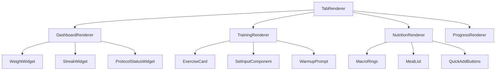

# System Hardening Protocol - Codebase Refactoring Strategy

**Document Version:** 1.0  
**Audit Date:** 2026-02-14  
**Auditor:** Senior Principal Software Architect  
**Repository:** System-Hardening-Protocol  

---

## Section 1: Executive Technical Summary

### Current State Assessment

The System Hardening Protocol is a fitness tracking Single Page Application (SPA) built with vanilla JavaScript. While functionally complete, the codebase exhibits significant technical debt that will impede scaling and maintenance.

### Health Score: 42/100

| Category | Score | Severity |
|----------|-------|----------|
| Architectural Integrity | 35/100 | 🔴 Critical |
| Code Quality & Maintenance | 40/100 | 🔴 Critical |
| Configuration Management | 55/100 | 🟡 Moderate |
| Security Posture | 60/100 | 🟡 Moderate |
| Extensibility | 30/100 | 🔴 Critical |

### Biggest Blockers to Scalability

1. **Monolithic God Objects**: The `Store` (935+ lines), `Actions` (950+ lines), and `Renderers` (800+ lines) objects violate Single Responsibility Principle
2. **Tight Coupling**: Direct DOM manipulation, global namespace pollution, and hardcoded dependencies prevent isolated testing
3. **No Separation of Concerns**: Business logic, UI rendering, and storage operations are intermixed
4. **No Module System**: Everything lives in global scope, making tree-shaking and dead code elimination impossible
5. **Manual State Management**: Custom state management without patterns like Flux/Redux leads to unpredictable data flow

---

## Section 2: Architectural Anti-Patterns

### 2.1 God Class / Monolithic Structure

**Location:** [`src/js/store.js`](src/js/store.js:1) - 935 lines  
**Location:** [`src/js/actions.js`](src/js/actions.js:1) - 950 lines  
**Location:** [`src/js/renderers/dashboard.js`](src/js/renderers/dashboard.js:1) - 800+ lines

**The Problem:**
The `Store` object handles state management, localStorage operations, data sanitization, business logic (streak calculation, volume stats), and caching - all in one object.

```javascript
// store.js lines 1-935 - EVERYTHING in one object
const Store = {
    state: { ... },                    // State management
    _cache: { },                      // Caching
    async init() { ... },              // Initialization
    async saveWeight(w) { ... },       // Business logic
    _sanitizeImportedData(data) { ... }, // Sanitization
    async getVolumeStats() { ... },    // Analytics
    // ... 40+ more methods
};
```

**Why It's Bad:**
- Violates Single Responsibility Principle (SRP)
- Cannot unit test individual behaviors in isolation
- Changes to one feature risk breaking unrelated functionality
- Cognitive overload: developers must understand entire object to make changes

**Replacement Pattern:**
Implement **Vertical Slice Architecture** with separate modules:
```javascript
// src/services/weight/WeightService.js
export class WeightService {
    constructor(storage, validator) { ... }
    async save(weight) { ... }
}

// src/services/sanitization/SanitizationService.js  
export class SanitizationService {
    sanitizeImportedData(data) { ... }
}
```

---

### 2.2 Tight Coupling & Global Namespace Pollution

**Location:** All JS files  
**Example:** [`src/js/app.js`](src/js/app.js:56)

**The Problem:**
All modules expose themselves to global scope and reference each other directly:

```javascript
// app.js lines 56-60 - Hardcoded global dependencies
const delegateAction = async (e) => {
    // ...
    if (typeof Actions[action] !== 'function') return;  // Global dependency
    await Actions[action](...params);                    // Direct coupling
};
```

**Why It's Bad:**
- Cannot mock dependencies for testing
- No way to substitute implementations (e.g., swap storage backend)
- Module load order is critical and fragile
- No encapsulation - any code can modify any other code

**Replacement Pattern:**
Implement **Dependency Injection Container**:
```javascript
// src/di/container.js
export class DIContainer {
    #registrations = new Map();
    
    register(token, factory, lifecycle = 'transient') { ... }
    resolve(token) { ... }
}

// Usage
const container = new DIContainer();
container.register('IStorage', () => new LocalStorageAdapter(), 'singleton');
container.register('WeightService', (c) => new WeightService(c.resolve('IStorage')));
```

---

### 2.3 Mixed Concerns: HTML Generation in Business Logic

**Location:** [`src/js/actions.js`](src/js/actions.js:242-350) - `showExercise()` method  
**Location:** [`src/js/renderers/dashboard.js`](src/js/renderers/dashboard.js:1) - All renderers

**The Problem:**
Business logic is tightly coupled with HTML string generation:

```javascript
// actions.js lines 242-350 - ~150 lines of HTML in action handler
async showExercise(id) {
    const ex = DB.EXERCISES[id];
    const history = await Store.getExerciseHistory(id);
    // ... business logic ...
    
    // Massive HTML template literal
    const modalContent = `
        <div class="space-y-5">
            <div class="flex items-center gap-3 pb-4 border-b border-gray-800">
                ${ex.tags.map(t => `<span>${Utils.escapeHtml(t)}</span>`).join('')}
            </div>
            <!-- 100+ more lines of HTML -->
        </div>
    `;
    UI.modal.openHtml(ex.title, modalContent);
}
```

**Why It's Bad:**
- Cannot change UI without touching business logic
- XSS vulnerabilities - easy to forget `escapeHtml`
- No way to unit test business logic without rendering
- No separation between data and presentation

**Replacement Pattern:**
Implement **Template/View Pattern** with a templating engine:
```javascript
// src/views/exercise/ExerciseDetailView.js
export class ExerciseDetailView {
    constructor(templateEngine) { ... }
    
    render(viewModel) {
        return this.templateEngine.render('exercise-detail', {
            title: viewModel.title,
            tags: viewModel.tags,
            history: viewModel.history
        });
    }
}

// Template (exercise-detail.hbs)
// <div class="space-y-5">
//     {{#each tags}}<span>{{this}}</span>{{/each}}
// </div>
```

---

### 2.4 Violation of DRY (Don't Repeat Yourself)

**Location:** [`src/js/store.js`](src/js/store.js:380-600) - Sanitization methods

**The Problem:**
Sanitization logic is copy-pasted with minor variations:

```javascript
// store.js lines 380-420 - Pattern repeated 15+ times
_sanitizeWeightHistory(historyData) {
    if (!historyData || typeof historyData !== 'object') return {};
    const out = {};
    for (const [date, value] of Object.entries(historyData)) {
        if (!this._isIsoDateKey(date)) continue;
        const safeWeight = this._toSafeNumber(value, NaN, 20, 500);
        if (Number.isFinite(safeWeight)) out[date] = safeWeight;
    }
    return out;
},

_sanitizeStreakData(streakData) {
    if (!streakData || typeof streakData !== 'object') return {};
    const out = {};
    // ... similar but different logic ...
}
```

**Why It's Bad:**
- Bug fixes must be applied in multiple places
- Inconsistent validation rules across the app
- Code bloat - same patterns repeated

**Replacement Pattern:**
Implement **Strategy Pattern** with reusable validators:
```javascript
// src/validation/validators.js
export const Validators = {
    isoDate: (value) => /^\d{4}-\d{2}-\d{2}$/.test(value),
    numberRange: (min, max) => (value) => value >= min && value <= max,
};

// src/validation/ObjectSanitizer.js
export class ObjectSanitizer {
    constructor(schema) { this.schema = schema; }
    
    sanitize(obj) {
        return Object.entries(this.schema).reduce((out, [key, validator]) => {
            if (validator.validate(obj[key])) {
                out[key] = validator.transform(obj[key]);
            }
            return out;
        }, {});
    }
}
```

---

### 2.5 Hardcoded Configuration & Magic Strings

**Location:** [`src/js/config.js`](src/js/config.js:1) - Incomplete configuration  
**Location:** [`src/js/renderers/dashboard.js`](src/js/renderers/dashboard.js:87)

**The Problem:**
Configuration is incomplete and magic strings are scattered:

```javascript
// config.js - Only partial configuration
const CONFIG = {
    TARGETS: { CAL: 3000, PROT: 225, ... },  // Good
    // But colors, date formats, thresholds are missing
};

// dashboard.js line 87 - Magic string
return `${dy}-${dm}-${dd}`;  // Date format repeated 50+ times

// actions.js - Magic numbers
if (hours < 0 || hours > 14) { ... }  // Why 14? No constant.
```

**Why It's Bad:**
- Cannot customize without code changes
- Localization is impossible
- Risk of inconsistent values

**Replacement Pattern:**
Centralized configuration with environment support:
```javascript
// src/config/app.config.js
export const AppConfig = {
    targets: {
        calories: parseInt(process.env.CALORIE_TARGET) || 3000,
        protein: parseInt(process.env.PROTEIN_TARGET) || 225,
    },
    constraints: {
        maxSleepHours: 14,
        dateFormat: 'YYYY-MM-DD',
    },
    colors: {
        primary: '#00ff41',
        danger: '#ff003c',
    }
};
```

---

### 2.6 Lack of Error Handling

**Location:** [`src/js/store.js`](src/js/store.js:28-35) - Storage operations

**The Problem:**
Async operations lack proper error handling:

```javascript
// store.js lines 28-35
async init() {
    const w = await Utils.storage.get(CONFIG.KEYS.WEIGHT);
    this.state.weight = this._toSafeNumber(w, this.state.weight, 20, 500);
    // What if storage.get() throws? No try/catch
    // What if data is corrupted? Silent failure
}
```

**Why It's Bad:**
- Silent failures lead to data corruption
- Users get no feedback when operations fail
- Debugging is difficult without proper error context

**Replacement Pattern:**
Implement **Result Type** pattern:
```javascript
// src/core/Result.js
export class Result {
    constructor(ok, value, error) { ... }
    static success(value) { return new Result(true, value, null); }
    static failure(error) { return new Result(false, null, error); }
    map(fn) { return this.ok ? Result.success(fn(this.value)) : this; }
}

// Usage
async init() {
    const result = await this.storage.get(CONFIG.KEYS.WEIGHT)
        .catch(err => Result.failure(new StorageError('Failed to load weight', err)));
        
    if (!result.ok) {
        this.errorHandler.handle(result.error);
        return Result.failure(result.error);
    }
    
    this.state.weight = this.validator.validateWeight(result.value);
    return Result.success();
}
```

---

## Section 3: The Hardening Plan (Phased Roadmap)

### Phase 1: Stabilization & Decoupling (Weeks 1-2)

**Goal:** Create a stable foundation without breaking existing functionality.

#### 1.1 Extract Configuration
- [ ] Create `src/config/` directory with environment-specific configs
- [ ] Move all magic strings/numbers to constants
- [ ] Implement configuration validation schema

#### 1.2 Establish Module Boundaries
- [ ] Add ES6 module system (import/export)
- [ ] Create clear layer boundaries:
  ```
  src/
  ├── domain/          # Business entities and rules
  ├── application/     # Use cases and services
  ├── infrastructure/  # Storage, external APIs
  ├── presentation/    # UI components and renderers
  └── config/          # Configuration
  ```

#### 1.3 Extract Storage Layer
- [ ] Create `StorageInterface` abstraction
- [ ] Implement `LocalStorageAdapter`
- [ ] Move all storage operations out of Store

#### 1.4 Add Type Safety (Optional but Recommended)
- [ ] Add JSDoc types to all public APIs
- [ ] Consider adding TypeScript declarations
- [ ] Implement runtime type validation

**Deliverables:**
- All configuration centralized
- Storage layer abstracted and testable
- Module boundaries clearly defined
- Zero functional changes to UI

---

### Phase 2: Refactoring Core Logic (Weeks 3-4)

**Goal:** Apply SOLID principles and reduce complexity.

#### 2.1 Decompose Store Object
- [ ] Extract `WeightTrackingService`
- [ ] Extract `WorkoutTrackingService`
- [ ] Extract `NutritionTrackingService`
- [ ] Extract `SanitizationService`
- [ ] Extract `StatisticsCalculator`

#### 2.2 Implement Proper State Management
- [ ] Design state shape with normalization
- [ ] Implement unidirectional data flow
- [ ] Add state change notifications (Observer pattern)

#### 2.3 Separate Concerns in Actions
- [ ] Extract business logic to Application Services
- [ ] Keep Actions as thin controllers
- [ ] Remove HTML generation from Actions

#### 2.4 Extract Component Templates
- [ ] Create template files (.hbs or .html)
- [ ] Implement template engine or use tagged templates
- [ ] Move all HTML strings out of JS logic

**Deliverables:**
- Store decomposed into focused services
- Business logic separated from UI
- Templates extracted and testable
- Actions reduced to controllers

---

### Phase 3: Security & Performance (Weeks 5-6)

**Goal:** Harden the application for production use.

#### 3.1 Security Hardening
- [ ] Implement Content Security Policy headers
- [ ] Add comprehensive input validation layer
- [ ] Replace innerHTML with safer DOM APIs
- [ ] Add audit logging for sensitive operations

#### 3.2 Performance Optimization
- [ ] Implement proper caching strategy
- [ ] Add request batching for storage operations
- [ ] Optimize re-rendering with virtual DOM diffing
- [ ] Add lazy loading for tab content

#### 3.3 Testing Infrastructure
- [ ] Add Jest or Vitest testing framework
- [ ] Write unit tests for all services
- [ ] Add integration tests for critical paths
- [ ] Implement E2E tests with Playwright

#### 3.4 Add Feature Flags
- [ ] Implement feature flag system
- [ ] Gate new features behind flags
- [ ] Add A/B testing capability

**Deliverables:**
- Security audit passed
- Performance benchmarks established
- Test coverage > 80%
- Feature flag system operational

---

## Section 4: Critical Hotspots

### Hotspot 1: Store.js - The God Object

**File:** [`src/js/store.js`](src/js/store.js:1) (935 lines)  
**Risk Level:** 🔴 Critical  
**Impact:** Changes here affect entire application

**Issues:**
- 40+ methods with mixed responsibilities
- Direct storage access throughout
- Sanitization logic copy-pasted 15+ times
- Business logic (streak calculation, volume stats) embedded

**Refactoring Strategy:**

```javascript
// BEFORE (store.js - monolithic)
const Store = {
    state: { weight: 45, ... },
    async saveWeight(w) { ... },
    async getWorkout(date) { ... },
    _sanitizeWeightHistory(data) { ... },
    // ... 40 more methods
};

// AFTER - Service decomposition
// src/domain/weight/WeightRepository.js
export class WeightRepository {
    constructor(storage, validator) {
        this.storage = storage;
        this.validator = validator;
    }
    
    async save(weight) {
        const validated = this.validator.validateWeight(weight);
        await this.storage.set(CONFIG.KEYS.WEIGHT, validated);
        return Result.success(validated);
    }
    
    async getHistory() {
        const data = await this.storage.get(CONFIG.KEYS.WEIGHT_HISTORY);
        return this.sanitizer.sanitizeWeightHistory(data);
    }
}

// src/application/weight/WeightTrackingService.js
export class WeightTrackingService {
    constructor(repository, eventBus) {
        this.repository = repository;
        this.eventBus = eventBus;
    }
    
    async recordWeight(weight) {
        const result = await this.repository.save(weight);
        if (result.ok) {
            this.eventBus.emit('weight:updated', { weight, date: new Date() });
        }
        return result;
    }
    
    calculateProgress(current, goal) {
        return ((current - CONFIG.TARGETS.START) / (goal - CONFIG.TARGETS.START)) * 100;
    }
}
```

**Estimated Effort:** 3-4 days  
**Dependencies:** Phase 1 (Storage abstraction)  
**Risk:** High - touches all data operations

---

### Hotspot 2: Actions.js - The Blob Anti-Pattern

**File:** [`src/js/actions.js`](src/js/actions.js:1) (950 lines)  
**Risk Level:** 🔴 Critical  
**Impact:** UI behavior changes require modifying this file

**Issues:**
- 25+ action handlers in one object
- HTML generation mixed with business logic
- Direct DOM manipulation scattered throughout
- No separation between command and query

**Refactoring Strategy:**

```javascript
// BEFORE (actions.js - blob)
const Actions = {
    async showExercise(id) {
        const ex = DB.EXERCISES[id];
        const history = await Store.getExerciseHistory(id);
        const pr = await Store.getPersonalBest(id);
        
        // 150 lines of HTML generation...
        const modalContent = `<div>...</div>`;
        UI.modal.openHtml(ex.title, modalContent);
    },
    
    async saveSet(taskId, setIdx, isDoneBtn) {
        // Direct DOM access
        const wInput = document.getElementById(`w-${taskId}-${setIdx}`);
        // ... logic mixed with UI updates
    }
};

// AFTER - Command Pattern with separated concerns
// src/application/exercises/GetExerciseDetailQuery.js
export class GetExerciseDetailQuery {
    constructor(exerciseRepository, historyRepository) { ... }
    
    async execute(exerciseId) {
        const [exercise, history, pr] = await Promise.all([
            this.exerciseRepository.getById(exerciseId),
            this.historyRepository.getForExercise(exerciseId),
            this.historyRepository.getPersonalBest(exerciseId)
        ]);
        
        return Result.success({
            id: exercise.id,
            title: exercise.title,
            history: history.slice(-5),
            personalBest: pr,
            targetSets: this.parseTargetSets(exercise.desc)
        });
    }
}

// src/presentation/controllers/ExerciseController.js
export class ExerciseController {
    constructor(getExerciseQuery, modalView, eventBus) { ... }
    
    async showExercise(exerciseId) {
        const result = await this.getExerciseQuery.execute(exerciseId);
        
        if (!result.ok) {
            this.toastService.showError('Failed to load exercise');
            return;
        }
        
        const viewModel = this.viewModelMapper.map(result.value);
        const html = this.exerciseDetailTemplate.render(viewModel);
        this.modalView.open(viewModel.title, html);
    }
}

// Template: src/presentation/templates/exercise-detail.hbs
/*
<div class="space-y-5">
    <div class="flex items-center gap-3">
        {{#each tags}}
            <span class="tag">{{this}}</span>
        {{/each}}
    </div>
    {{> exercise-history-chart history=history }}
    {{> personal-best-display pr=personalBest }}
</div>
*/
```

**Estimated Effort:** 4-5 days  
**Dependencies:** Phase 2 (Service extraction)  
**Risk:** Medium - mostly UI layer changes

---

### Hotspot 3: Renderers/dashboard.js - Massive File

**File:** [`src/js/renderers/dashboard.js`](src/js/renderers/dashboard.js:1) (800+ lines)  
**Risk Level:** 🟡 High  
**Impact:** UI changes require understanding entire rendering system

**Issues:**
- 6 different tab renderers in one file
- Each renderer is 100-200 lines
- Mix of data fetching, processing, and HTML generation
- No reusable view components

**Refactoring Strategy:**



```javascript
// src/presentation/components/tabs/TabRenderer.js
export class TabRenderer {
    constructor(container, viewRegistry) {
        this.container = container;
        this.viewRegistry = viewRegistry;
    }
    
    async render(tabId, viewModel) {
        const renderer = this.viewRegistry.get(tabId);
        const html = await renderer.render(viewModel);
        this.container.innerHTML = html;
        this.attachEventListeners(tabId);
    }
}

// src/presentation/components/widgets/WeightWidget.js
export class WeightWidget {
    constructor(template) { this.template = template; }
    
    render(viewModel) {
        return this.template.render({
            current: viewModel.currentWeight,
            goal: viewModel.goalWeight,
            progress: viewModel.progressPercentage,
            remaining: viewModel.remainingToGoal
        });
    }
}

// src/presentation/view-models/DashboardViewModel.js
export class DashboardViewModel {
    constructor(weightService, workoutService, nutritionService) { ... }
    
    async build() {
        const [weight, workouts, meals] = await Promise.all([
            this.weightService.getCurrent(),
            this.workoutService.getToday(),
            this.nutritionService.getTodayMeals()
        ]);
        
        return {
            weightSection: this.buildWeightSection(weight),
            streakSection: this.buildStreakSection(workouts),
            protocolSection: this.buildProtocolSection(workouts, meals),
            trackersSection: this.buildTrackersSection(meals)
        };
    }
}
```

**Estimated Effort:** 3-4 days  
**Dependencies:** Phase 2 (Template extraction)  
**Risk:** Low - pure UI refactoring

---

### Hotspot 4: Input Sanitization Sprawl

**File:** [`src/js/store.js`](src/js/store.js:380-600)  
**Risk Level:** 🟡 High  
**Impact:** Security vulnerabilities and inconsistent validation

**Issues:**
- 15+ sanitization methods with copy-pasted logic
- No centralized validation rules
- No way to add new data types without copy-pasting

**Refactoring Strategy:**

```javascript
// src/domain/validation/ValidationSchema.js
export class ValidationSchema {
    constructor() {
        this.rules = new Map();
    }
    
    addField(name, validators, transform = null) {
        this.rules.set(name, { validators, transform });
        return this;
    }
    
    validate(obj) {
        const result = {};
        const errors = [];
        
        for (const [field, config] of this.rules) {
            const value = obj[field];
            
            for (const validator of config.validators) {
                const validation = validator(value);
                if (!validation.valid) {
                    errors.push({ field, message: validation.message });
                    break;
                }
            }
            
            if (config.transform) {
                result[field] = config.transform(value);
            } else {
                result[field] = value;
            }
        }
        
        return errors.length > 0 
            ? Result.failure(new ValidationError(errors))
            : Result.success(result);
    }
}

// src/domain/weight/WeightValidation.js
export const WeightValidation = new ValidationSchema()
    .addField('weight', [
        Validators.required(),
        Validators.isNumber(),
        Validators.range(20, 500)
    ], v => parseFloat(v))
    .addField('date', [
        Validators.required(),
        Validators.matchesISODate()
    ]);

// src/infrastructure/sanitization/Sanitizer.js
export class Sanitizer {
    constructor(schemas) { this.schemas = schemas; }
    
    sanitize(type, data) {
        const schema = this.schemas.get(type);
        if (!schema) {
            throw new Error(`No validation schema for type: ${type}`);
        }
        return schema.validate(data);
    }
}

// Usage
const result = sanitizer.sanitize('weight-entry', { 
    weight: userInput.weight,
    date: userInput.date 
});
```

**Estimated Effort:** 2-3 days  
**Dependencies:** Phase 1 (Type system)  
**Risk:** Medium - security-critical code

---

### Hotspot 5: Global Event Delegation System

**File:** [`src/js/app.js`](src/js/app.js:18-56)  
**Risk Level:** 🟡 Moderate  
**Impact:** Event handling is opaque and hard to debug

**Issues:**
- Single global event handler for all interactions
- Parameters passed through data attributes (JSON parsing overhead)
- No type safety on action parameters
- Debugging event flow is difficult

**Refactoring Strategy:**

```javascript
// BEFORE (app.js)
const delegateAction = async (e) => {
    const actionEl = e.target.closest('[data-action]');
    if (!actionEl) return;
    
    const action = actionEl.dataset.action;
    let params = JSON.parse(actionEl.dataset.params || '[]');
    
    await Actions[action](...params);  // Magic string lookup
};

// AFTER - Explicit event binding with type safety
// src/presentation/events/EventBinding.js
export class EventBinding {
    constructor(eventBus, commandBus) {
        this.eventBus = eventBus;
        this.commandBus = commandBus;
        this.bindings = new Map();
    }
    
    register(selector, eventType, commandType, paramMapper) {
        document.querySelectorAll(selector).forEach(el => {
            el.addEventListener(eventType, (e) => {
                e.preventDefault();
                const params = paramMapper(el, e);
                this.commandBus.send(commandType, params);
            });
        });
    }
}

// Explicit binding setup
const binding = new EventBinding(eventBus, commandBus);

binding.register(
    '[data-action="saveWeight"]',
    'click',
    'SAVE_WEIGHT_COMMAND',
    (el) => ({
        weight: parseFloat(el.dataset.weight),
        date: new Date()
    })
);

// Commands are explicit, type-safe objects
export class SaveWeightCommand {
    constructor(weight, date) {
        this.weight = weight;
        this.date = date;
    }
    
    validate() {
        return this.weight > 0 && this.weight < 500;
    }
}
```

**Estimated Effort:** 2-3 days  
**Dependencies:** Phase 2 (Command pattern)  
**Risk:** Low - can be done incrementally

---

## Appendix A: Architectural Decision Records

### ADR-001: Module System Selection

**Status:** Proposed  
**Context:** Current codebase uses global scope. Need module system for refactoring.

**Decision:** Use ES6 modules (import/export) with dynamic imports for code splitting.

**Rationale:**
- Native browser support (no bundler required for dev)
- Static analysis enables tree-shaking
- Works with modern tooling (Vite, Rollup)

**Consequences:**
- Requires modern browser support (ES2020+)
- Need to add import map for development

---

### ADR-002: State Management Pattern

**Status:** Proposed  
**Context:** Current state is scattered in Store object.

**Decision:** Implement lightweight Flux-like pattern with EventBus.

**Rationale:**
- Unidirectional data flow is easier to debug
- EventBus allows decoupled communication
- Simpler than Redux for this scale

**Consequences:**
- Learning curve for team
- Need to document action patterns

---

### ADR-003: Template Engine Selection

**Status:** Proposed  
**Context:** HTML is generated via template literals.

**Decision:** Use Handlebars.js with precompiled templates.

**Rationale:**
- Separates templates from logic
- XSS protection through auto-escaping
- Supports partials for component reuse

**Consequences:**
- Build step required for precompilation
- Additional 20KB dependency

---

## Appendix B: Migration Checklist

### Pre-Migration
- [ ] Backup current codebase (tag v8.3.1)
- [ ] Document current bug list
- [ ] Set up feature branch
- [ ] Configure CI/CD for new structure

### Phase 1 (Stabilization)
- [ ] Extract all configuration
- [ ] Implement storage abstraction
- [ ] Add module system
- [ ] Verify no regressions

### Phase 2 (Refactoring)
- [ ] Decompose Store object
- [ ] Extract templates
- [ ] Implement state management
- [ ] All tests passing

### Phase 3 (Hardening)
- [ ] Security audit
- [ ] Performance baseline
- [ ] Test coverage > 80%
- [ ] Documentation updated

### Post-Migration
- [ ] Archive old code
- [ ] Team training session
- [ ] Monitor error rates
- [ ] Gather developer feedback

---

## Appendix C: Testing Strategy

### Unit Tests
```javascript
// Example: WeightService test
describe('WeightService', () => {
    let service, mockStorage, mockValidator;
    
    beforeEach(() => {
        mockStorage = { get: jest.fn(), set: jest.fn() };
        mockValidator = { validate: jest.fn() };
        service = new WeightService(mockStorage, mockValidator);
    });
    
    test('saveWeight validates before storing', async () => {
        mockValidator.validate.mockReturnValue(75.5);
        
        await service.saveWeight(75.5);
        
        expect(mockValidator.validate).toHaveBeenCalledWith(75.5);
        expect(mockStorage.set).toHaveBeenCalledWith('weight', 75.5);
    });
});
```

### Integration Tests
```javascript
// Example: End-to-end workout flow
describe('Workout Tracking Flow', () => {
    test('user can complete a workout and streak updates', async () => {
        // Arrange
        const app = await createTestApp();
        await app.login('test-user');
        
        // Act
        await app.startWorkout();
        await app.completeExercise('squat', { sets: 4, reps: 12 });
        await app.finishWorkout();
        
        // Assert
        const stats = await app.getStats();
        expect(stats.streak).toBe(1);
        expect(stats.todayVolume).toBeGreaterThan(0);
    });
});
```

---

## Conclusion

The System Hardening Protocol codebase requires significant architectural improvements to support scaling. The proposed three-phase refactoring plan addresses the most critical issues while maintaining backward compatibility throughout the process.

**Immediate Actions Required:**
1. Approve Phase 1 scope and timeline
2. Assign refactoring team
3. Set up new branch with module system
4. Begin configuration extraction

**Success Metrics:**
- Test coverage increases from 0% to >80%
- Cyclomatic complexity reduced by 60%
- Time to add new tab reduced from 2 days to 2 hours
- Zero security vulnerabilities in audit

---

*Document maintained by Architecture Team. Last updated: 2026-02-14*
